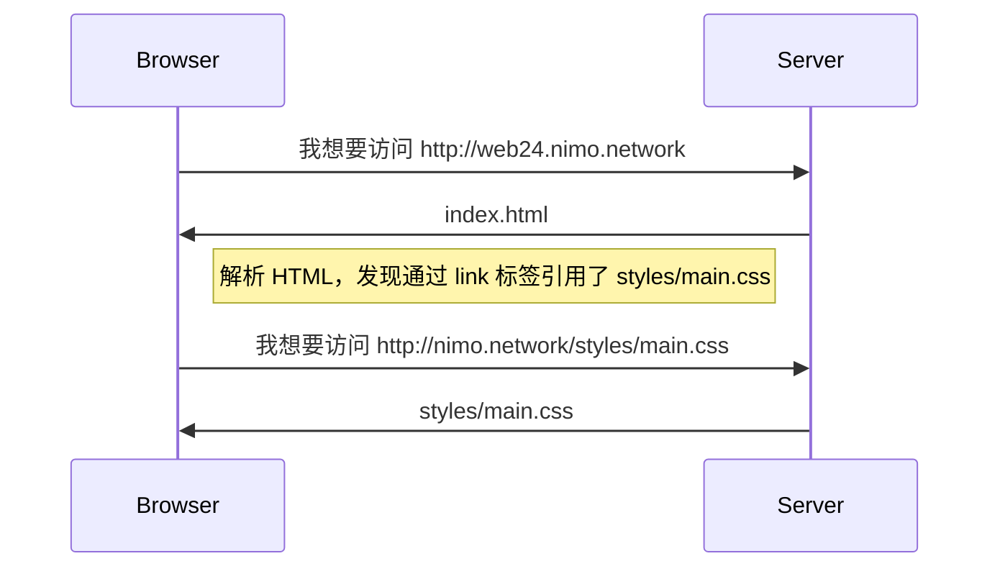
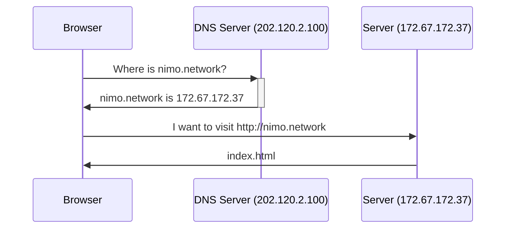

---
# try also 'default' to start simple
theme: seriph 
# apply any windi css classes to the current slide
class: 'text-center'
# https://sli.dev/custom/highlighters.html
highlighter: shiki
# show line numbers in code blocks
lineNumbers: true
# some information about the slides, markdown enabled
info: |
   Introduction to Web Development, Chapter 02 HTTP
# persist drawings in exports and build
drawings:
  persist: true
background: 'https://source.unsplash.com/collection/94734566/1920x1080'
---

# Intro to Web Dev

我也想要一个网站

---

# 开始之前

- 本节课的内容并非前端开发必备的知识，如果暂时没有听懂也可以进行后续课程
- 上次课中介绍的 CSS 内容比较简略，这里有几个简单的网站可以帮助大家：
    + [MDN Web 教程](https://developer.mozilla.org/zh-CN/docs/Learn/Getting_started_with_the_web)
    + [w3school](https://www.w3schools.com)  一个带有教程的 HTML & CSS 网站
    + [cssreference.io](https://cssreference.io)  CSS 属性合集，可以用于查看属性的不同值和对应的效果
    + [CSS Tricks](https://css-tricks.com)  提供 CSS 教程、指南、新闻和资源，老手和新手皆宜

---

# 访问一个网站的时候发生了什么？



---

# 访问一个网站的时候发生了什么？

一切似乎非常正常...但是浏览器是从互联网的哪个角落里下载的这个文件呢？

- DNS: Domain Name System
- 每个在互联网上能够访问的网站都有一个公网 IP，DNS 系统负责维护 **域名-IP** 的映射关系
- 浏览器在发送 HTTP 请求前会先使用 DNS 协议查询域名对应的 IP

## 怎么查一个域名的 IP？

DNS 查询的常见工具有 `nslookup`、`dig` 等

```bash
# windows
nslookup nimo.sjtu.edu.cn
# macOS / Linux
dig nimo.sjtu.edu.cn
```

---

# 访问一个网站的时候发生了什么？

一切似乎非常正常...但是浏览器是从互联网的哪个角落里下载的这个文件呢？


---

# 访问一个网站的时候发生了什么？

等一下...那 HTTPS 是什么？

`HTTPS` = `HTTP` + `TLS`!

## 什么是 HTTPS

- HTTPS 可以理解为 HTTP 的加密版本
- 服务器上会配有 TLS 证书，该证书会在正式获取网站内容前进行验证，防止网站时假冒的
- 验证的过程使用了非对称加密。非对称加密中存在两个密钥，一个密钥加密后的内容只能用另一个密钥解密

---

# 访问一个网站的时候发生了什么？

```mermaid
sequenceDiagram
  participant B as Browser
  participant D as DNS Server
  participant S as Server
  
  B ->>+ D: Where is nimo.network
  D ->>- B: nimo.network is 202.120.2.1
  
  S <-> B: Server Verification & Key Discussion
  
  B ->>+ S: I want to visit https://nimo.network
  S ->>- B: index.html
```

---

# 我们应该关注什么？

部署一个网站看起来很复杂，应该怎么做呢？

- 对于开发者来说...
    + 将 `index.html` 和其他需要部署的网页写好
    + 将资源文件（图片、CSS 和 JS）文件放在合适的位置

- 对于运维同学来说...
    + DNS 系统设置
    + 域名证书
    + 向互联网提供静态文件（如已经写好了的网页）
    + 服务器系统维护

---

# 什么是服务器？

服务器就是一台电脑，上面可能跑着 Windows 系统或者 Linux 系统

- 你的电脑也可以成为网页服务器
- 保持 TCP 80 和 443 端口畅通
- 拥有公网 IP


## 常见 Linux 发行版

<div grid="~ cols-4" class="mt-4">

<div class="text-center p-4">
  
  <p>Debian</p>
</div>

<div class="text-center p-4">
  
  <p>Ubuntu</p>
</div>

<div class="text-center p-4">
  
  <p>Fedora</p>
</div>

<div class="text-center p-4">
  
  <p>CentOS</p>
</div>

</div>

---
layout: section
---

# 休息一下

---
layout: section
---

# 如何部署一个网站

如何让大家能够通过互联网访问自己的网站

---

# 如何部署一个网站

## 租用一台拥有公网 IP 的服务器

使用 Web Server 将文件提供给用户

+ 常见有 Apache 和 Nginx
+ 将文件夹映射为 URL
    
    `http://domain.com/folder1/file2` 转成 `folder1/file2`

    `http://domain.com/styles/main.css` 转成 `styles/main.css`

+ 特殊处理：当只提供了**文件夹名**而没有提供文件名的 URL，系统一般会默认提供 `index.html` 文件

---

# Lab 1 - 在自己的电脑上启动一个 Web Server

> 在自己的电脑上也能启动 Web Server

1. 确保你已经在机器上安装了 [Python3](https://www.python.org/downloads/)
2. 打开一个 `PowerShell` 窗口
3. 使用 `cd` 命令进入你的网站文件夹
    + `cd ..` 命令可以返回上一层文件夹
    + `pwd` 命令可用于查看当前工作目录的路径
    + `ls` 命令可用于查看当前工作目录下有什么文件
4. 确保已经 `cd` 到相关位置后，运行以下代码：

```bash
python3 -m http.server
```

输出应该与以下类似：

```bash
Serving HTTP on :: port 8000 (http://[::]:8000/) ...
```

这时我们打开浏览器，输入 `http://localhost:8000`，就可以看到你的网站了！

---

# Lab 1 - 补充知识

## 一些常见的 IP

- `127.0.0.1` → 本机的 IP
- `localhost` → 一个域名，永远指向本机 IP
- `0.0.0.0` → 一般用作指代所有 IP
    + 通常网站服务器（Web Server）都会提供一个`想要监听的 IP`的选项
    + 该选项填写 `0.0.0.0` 即为监听所有 IP
    + 该选项填写 `127.0.0.1` 即为仅监听本机

## 其他 Q&A

- 域名并不是搭建网站的必需品，直接用 IP 访问也是可以的
- 一般来说，服务器会监听 `80` 端口，而 `443` 端口用于 HTTPS
    + `http` 协议是基于 `tcp` 协议的，因此需要一个端口号
    + 在不填写端口号时会使用默认的端口号（`http` → 80 / `https` → 443）

---

# 如何部署一个网站

> 如果我们找不到能被互联网访问的机器...那就试试白嫖！

- 🤔 部署一个小型的静态网站需要的资源不多
    + 文件资源：整个网站不大，一般包含图片后是 `MB` 级别
    + 网络资源：网站的访问量有限，不会对服务器造成很大压力

- 🤩 云服务商会提供免费的静态网站部署服务
    + 吸引客户
    + 按量计费，资源使用较多时可以收钱
    + 比如：[Vercel](https://vercel.com/)、[Netlify](https://www.netlify.com/)、[Github Pages](https://pages.github.com/)、[Cloudflare Pages](https://pages.cloudflare.com/)

<br />

> **为什么不选择国内的服务商？**
> 
> 在国内提供网络内容服务需要预先备案，太麻烦了 :(

---

# Lab 2 - 使用 Cloudflare Pages 部署网站

> 考虑到网络因素，Cloudflare Pages 是最好的选择

<br />

1. 新建一个 `Cloudflare` 账户
2. 点击左侧导航栏的 `Workers & Pages` 项目
3. 将自己的自我介绍页面打包上传
4. 点击 `部署` 即可
5. 部署后 Cloudflare 会分配一个以 `pages.dev` 结尾的域名，可以通过这个域名访问你的网站

<br />

- 参考链接：https://developers.cloudflare.com/pages/get-started/direct-upload/#drag-and-drop

---

# Lab 2 - 其他知识

## DNS 解析记录

- `A` 记录：将域名解析为 IPv4 地址
- `AAAA` 记录：将域名解析为 IPv6 地址
- `CNAME` 记录：将域名解析为另一域名
- `MX` 记录：邮件相关
- `TXT` 记录：无特殊功能，一般用于验证域名所有者

## 试试看

```bash
# Windows 用户
Resolve-DnsName -Name example.com
Resolve-DnsName -Server 202.120.2.100 -Name www.sjtu.edu.cn -Type A
# Linux 用户
dig nimo.sjtu.edu.cn
```

---

# Lab 3 - 在 Cloudflare Pages 上使用自定义域名

> 为了让网站看起来更帅，我们可以使用自己的域名

1. 填写[问卷](https://wj.sjtu.edu.cn/q/TE5PighF)
2. 在 Cloudflare Pages 的项目中找到 `Custom Domains` 选项
3. 填写你在问卷中填写的三级域名加上 `nimo.page`（需要以 `nimo.page` 结尾）
4. 然后~~摇铃~~呼唤🀄
5. 通过自定义的域名访问网站吧！

---
layout: section
---

# 🎉 大功告成！

先别走，后面还有

---

# 还有人民群众喜闻乐见的作业 😈

## 作业 1

[https://net.sjtu.edu.cn/dorm/index.php](https://net.sjtu.edu.cn/dorm/index.php) 的画面有点点不好看，发挥想象力让这个网站更好看点

## 作业 2

<iframe height="300" style="width: 100%;" scrolling="no" title="Ex03 - Cards" src="https://codepen.io/truco/embed/KjxBJm?default-tab=result" frameborder="no" loading="lazy" allowtransparency="true" allowfullscreen="true">
  See the Pen <a href="https://codepen.io/truco/pen/KjxBJm">
  Ex03 - Cards</a> by Bill (<a href="https://codepen.io/truco">@truco</a>)
  on <a href="https://codepen.io">CodePen</a>.
</iframe>