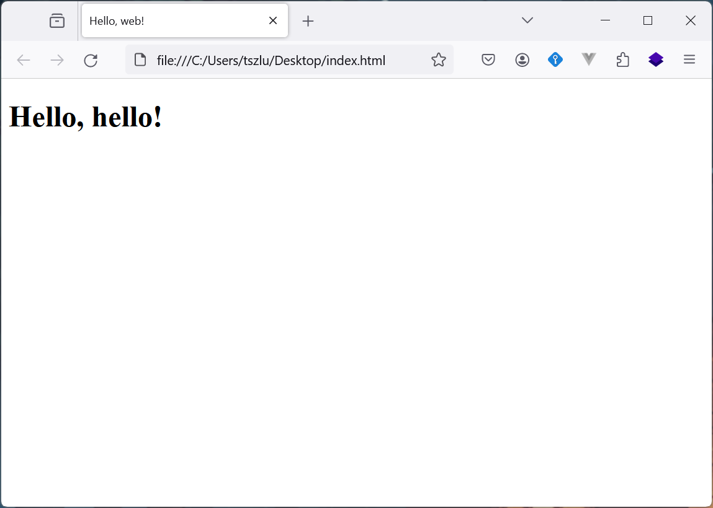

## 写在前面

喜欢您来！

Web 开发并不困难和复杂。开发网站并**不像**高数和算法课需要解题和推理，恰恰相反，开发网站更像是用已有的工具搭积木。
因此，只要愿意大胆想象并勤加练习，每个人都可以做出令人惊叹的网站。

本学期的 Web 课程加起来只有 6 次课程，想要仅凭借这 6 次课程完全掌握 Web 开发的前沿知识是比较困难的，因此我们会在每节课后发布一些 lab 供大家联系和玩耍。
建议每一位想要学习 Web 的同学每周额外花 3 小时左右完成这些 lab，相信大家会有收获。

## 什么是 Web 开发

我们通常将 Web 开发分为前端（Frontend）和后端（Backend）两个部分。
前端（Frontend）通常用于展现内容，比如你现在看到的页面就是前端的一部分。与前端相关的工具包括 HTML、CSS 和 Javascript，这些工具将会在后面的课程中和大家见面。
后端（Backend）通常藏在看不见的地方，负责给网页前端提供内容。后端开发更加侧重处理逻辑，数据库、服务器运维等概念会在后端出现。

需要注意的是，前端和后端的知识重叠部分并不多，如果仅仅对其中一部分感兴趣也欢迎来看看！

## 迈出第一步

在开始你的 Web 旅程之前，你需要在电脑上安装一个合适的**编辑器**和一个足够年轻的**浏览器**。Web 开发比较推荐的浏览器有 `Firefox`、`Chrome` 和 `Chromium`，选择其中一个下载就可以。

编辑器的选择有很多，你可以从以下软件中选择其中一个：

- [Visual Studio Code](https://code.visualstudio.com/)
- [Sublime Text](https://www.sublimetext.com/)
- [Visual Studio](https://visualstudio.microsoft.com/)
- [WebStorm](https://www.jetbrains.com/webstorm/)
- ~~记事本~~

本课程将会使用 `VSCode` 作为编辑器，如果没有偏好的话建议你也安装一个。

## Hello, Web

安装好编辑器之后，我们可以开始编写我们的第一个网页了。

创建一个网页非常简单，在桌面上新建一个文本文件，将它命名为 `index.txt`。用刚刚安装的**编辑器打开**这个文件，并且写入以下的内容：

```html
<!DOCTYPE html>
<html>
    <head>
        <title>Hello, web!</title>
    </head>
    <body>
        <h1>Hello, hello!</h1>
    </body>
</html>
```

接下来就是见证奇迹的时刻！将文件重命名为 `index.html`，然后**用浏览器打开**这个文件，你应该能看到如下的画面。



恭喜！你已经完成了第一个网页的编写，是不是还挺简单的！

## 其他工具

### NodeJS & NPM

NodeJS 是一个 JavaScript 运行环境，让我们可以在电脑上运行 JavaScript （而不是浏览器里）。
前端开发的很多框架都需要用到 NodeJS，我们在第二课的网页部署课程中也会用到这个工具，请在第二课前将工具安装好。

NodeJS 的官网是 [https://nodejs.org/](https://nodejs.org/)，目前最新的长期支持（Long-Term Support, LTS）版本是 `20.12.0`。
大多数的框架都对长期支持版本有更好的适配，因此我们建议大家下载最新的 LTS 版本（即 `20.12.0`），而不是最新版（即 `21.7.1`）。

### Git & Github (Optional)

Git 是一个版本管理工具，用于管理版本~~（废话）~~。虽然我们在本课程中不会涉及到 Git 相关的内容，但是笔者诚挚建议大家学习使用 Git，这对将来的开发工作很有帮助。

Git 的官网在 [https://git-scm.com/](https://git-scm.com/)，使用 `Linux` 发行版或者 `macOS` 的同学可以使用 `brew` / `apt` / `yum` 等包管理器安装 `git`。

Github 是世界上最大型的程序员交友网站（划掉），如果对开源工作有兴趣的话可以创建一个账号，以后可以将自己的项目放到 Github 上。

网络上 Git 的教程比较多，笔者比较推荐以下的教程：

- [Learn Git Branching](https://learngitbranching.js.org/?locale=zh_CN)：完成基础篇即可学会日常操作
